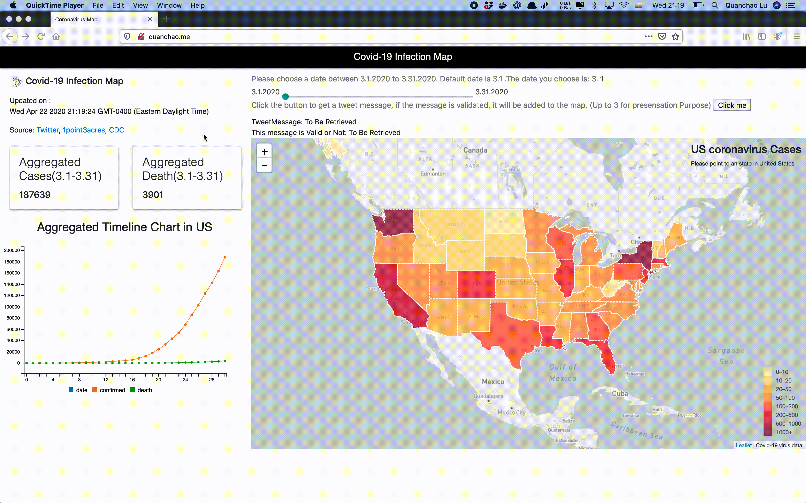

# Covid-19 Infection Map

This is the repository of the source code for the Covid-19 Infection Map([quanchao.me](http://quanchao.me)). The interactive maps enables people to see the trends of Covid-19 in United States from Mar.1 to Mar.31. It can also detect the tweet events and predict if this tweet is related to a real Covid-19 event. After that, it will display the valid Tweet Message on the map. The dataset is collected from the CDC official source as well as the Tweet as the unconfirmed source.
## Data Sources 
1. [tweet](https://developer.twitter.com/en/docs/tweets/search/api-reference/get-search-tweets)
2.  [CDC](https://www.cdc.gov/)

This is the sample data after preprocessing.

``` 
CDC data:

{

	"longitude": -119.4179,
	"latitude": 36.7783,
	"messgae": Confusion prevails overr how many people in Iran have been infected, and how many have died,, from the coronavirus. \u00a0 https://t.co/FiAQxu6uB"
}

Tweet Data:

{

	"Alabama":
		{"2020-03-13":{"cofirmed": "6", "deaths":"0"}
		{"2020-03-14":{"confirmed":"12", "deaths": "0"}
}

``` 

## Timechart of U.S. cases
You can see the cases in United State for any date between 3.1-3.31. 

To create a map, we need the information about the shapes of states in United States. Since they are not very big, we stored and loaded them via GeoJson. The following is a sample json data.

```
{

	"type": "Feature"
	"properties":{
		"name": "Texas",
		"density": 57
	}
	"geometry": ...
}
```


The core part of the codes is to upate information on the map according to the selected data.
```
 function updateCorona(date) {
    for (var i = 0; i < statesData["features"].length; i++) {
        stateName = statesData.features[i].properties.name
        if (coronaData[stateName] == undefined) {
            console.warn(stateName);
            statesData.features[i].properties.density = 0;
        } else if (coronaData[stateName][date] == undefined) {
            statesData.features[i].properties.density = 0;
        } else {
            statesData.features[i].properties.density = coronaData[stateName][date]["confirmed"];
       	}                    
    }
}
```


## Tweet detction
In  this part, you can click on the "Click Me" button to retrieve a tweet from server, after that, it will send the message to backend to predict if this message is a valid one related to Covid-19. If so, it will added this information to the map with a marker which you can click to get detailed information. Otherwise, you will get a hint saying the message is invalid. After you have used all tweets in the server, all the Markers will be cleared.


```
function buttonFunction() {
                    clickTimes += 1
                    if (clickTimes == tweetData.length + 1) {
                        var message = document.getElementById('messageTweet')
                        var valid = document.getElementById('messageTweetValid')
                        message.innerHTML = "Click the Button to retrieve"
                        valid.innerHTML = ""
                        clickTimes =  clickTimes -tweetData.length-1
                        for( i in layerList){
                            layerList[i].remove()
                        }


                    } 
                    else {

                        var message = document.getElementById('messageTweet')
                        var valid = document.getElementById('messageTweetValid')
                        message.innerHTML = tweetData[clickTimes-1]["message"]
                        if(validFlag){
                        	valid.innerHTML = "valid"
                        	latitude = tweetData[clickTimes-1]["latitude"]
                        	longitude = tweetData[clickTimes-1]["longitude"]
                        	var layerid = L.marker([latitude, longitude], {
                            	icon: iconArray[clickTimes%3]
                        	}).addTo(map).bindPopup(tweetData[clickTimes-1]["message"]);
                        	layerList.push(layerid)
                        }
                        else{
                        	valid.innerHTML = "invalid, therefore not added to map"
                        }
                    }
                }
```

